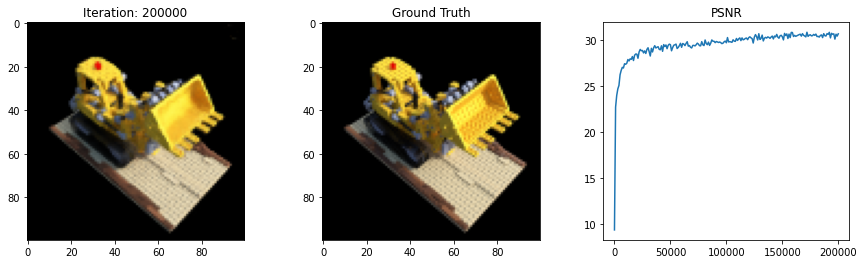

# Neural Radiance Fields (Re-Implementation)

This repository implements a minimal training and inference package around Neural Radiance Fields (NeRF). See the original paper "NeRF: Representing Scenes as Neural Radiance Fields for View Synthesis," by Ben Mildenhall, Pratul P. Srinivasan, Matthew Tancik, Jonathan T. Barron, Ravi Ramamoorthi, Ren Ng at ECCV 2020.

<div style="background-color: white;"></div>

## Installation

The package may be installed via pip:

```bash
pip install nerf-pytorch
```

## Rendering

The NeRF class implements all core functionality for volume rendering of a neural radiance field. You can initialize your own NeRF model and render an image using your (untrained) model with the following snippet.

```python
from nerf.model import NeRF
import torch

# build the NeRF model with default parameters
model = NeRF().cuda()

# select a pose for the camera in homogeneous coordinates
pose = torch.eye(4).unsqueeze(0)

# settings for the pinhole camera
image_h = 100
image_w = 100
focal_length = 130.0

# settings for ray sampling and pose normalization
near = 2.0
far = 6.0
pose_limit = 6.0

# number of points sampled along the ray
num_samples_per_ray = 64
max_chunk_size = 1024

# whether to sample points randomly
random = True

# standard deviation of gaussian noise added to density head
density_noise_std = 1.0

# render the image using volume rendering
with torch.no_grad():

    image = model.render_image(
        pose.cuda(), 
        image_h, 
        image_w, 
        focal_length, 
        near, 
        far, 
        num_samples_per_ray, 
        max_chunk_size=max_chunk_size,
        random=random, 
        density_noise_std=density_noise_std, 
        pose_limit=pose_limit)
        
```

## Training

In addition to rendering, this package provides several helpful utilities for training a NeRF model with supervised learning given image pose pairs. You can build a dataset for training a NeRF model using the provided PixelRayDataset class.

```python
from nerf.dataset import PixelRayDataset
from nerf.model import NeRF
import torch

# build the NeRF model with default parameters
model = NeRF().cuda()

# distanced of the clipping planes along the cameta z axis
near = 2.0
far = 6.0

# settings for the pinhole camera
focal_length = 130.0

# number of points sampled along the ray
num_samples_per_ray = 64

# whether to sample points randomly
random = True

# standard deviation of gaussian noise added to density head
density_noise_std = 1.0

# denominator used when normalizing pose vectors in [-1, 1]
pose_limit = 6.0

# create a dataset of pixels and corresponding rays for NeRF
dataset = PixelRayDataset(images, poses, focal_length)
data_loader = data.DataLoader(dataset, batch_size=1024, shuffle=True)

for target, rays_o, rays_d in data_loader:
        
    # render a pixel for each ray using NeRF
    pixels = model.render_rays(
        rays_o,
        rays_d,  
        near, 
        far, 
        num_samples_per_ray, 
        random=random, 
        density_noise_std=density_noise_std, 
        pose_limit=pose_limit)

    # mean squared error in pixels
    loss = ((pixels - target) ** 2).mean()
    
```

## Citation

Credit for the idea of NeRF goes to the original authors in their 2020 paper.

```
@misc{mildenhall2020nerf,
    title={NeRF: Representing Scenes as Neural Radiance Fields for View Synthesis},
    author={Ben Mildenhall and Pratul P. Srinivasan and Matthew Tancik and Jonathan T. Barron and Ravi Ramamoorthi and Ren Ng},
    year={2020},
    eprint={2003.08934},
    archivePrefix={arXiv},
    primaryClass={cs.CV}
}
```

However, if you find this package, please consider citing it!

```
@misc{trabucco2021nerf,
  title={NeRF},
  author={Trabucco, Brandon},
  howpublished={\url{https://github.com/brandontrabucco/nerf}},
  year={2021}
}
```

