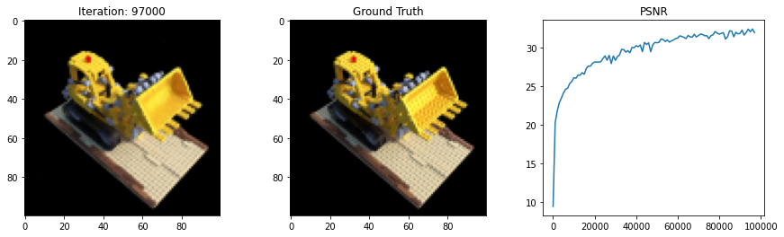

# Neural Radiance Fields (Re-Implementation)

This repository implements a minimal training and inference package around Neural Radiance Fields (NeRF). See the original paper "NeRF: Representing Scenes as Neural Radiance Fields for View Synthesis," by Ben Mildenhall, Pratul P. Srinivasan, Matthew Tancik, Jonathan T. Barron, Ravi Ramamoorthi, Ren Ng at ECCV 2020.

<div style="background-color: white;"></div>

## Installation

The package may be installed via pip from my PyPI package:

```bash
pip install nerf-pytorch
```

## Citation

Credit for the idea of NeRF goes to the original authors in their 2020 paper.

```
@misc{mildenhall2020nerf,
    title={NeRF: Representing Scenes as Neural Radiance Fields for View Synthesis},
    author={Ben Mildenhall and Pratul P. Srinivasan and Matthew Tancik and Jonathan T. Barron and Ravi Ramamoorthi and Ren Ng},
    year={2020},
    eprint={2003.08934},
    archivePrefix={arXiv},
    primaryClass={cs.CV}
}
```

However, if you find this package helpful, please consider citing it!

```
@misc{trabucco2021nerf,
  title={NeRF},
  author={Trabucco, Brandon},
  howpublished={\url{https://github.com/brandontrabucco/nerf}},
  year={2021}
}
```

